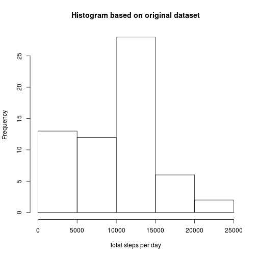
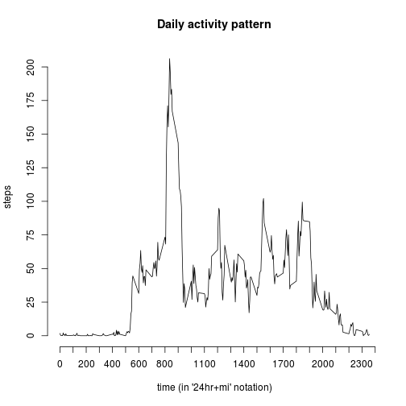
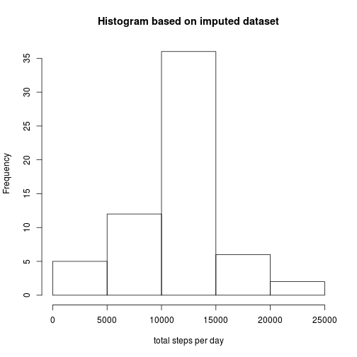
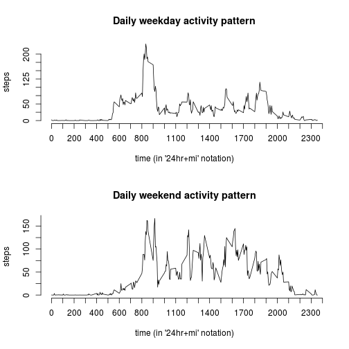
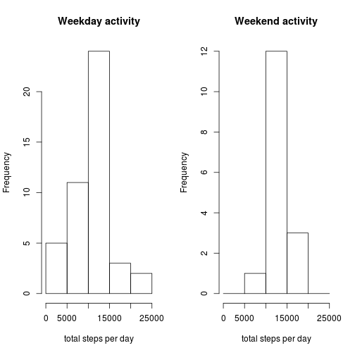

## Loading and preprocessing the data
The activity monitoring data is stored in the '/data/raw'-directory of this project. *Note that I am working on a pc with the Linux operating system, therefore the directory structure may seem unfamiliar.* The data is stored in csv-format, including header columns.

```r
activity <- read.csv("./data/raw/activity.csv", header=T, sep=",")
```
To get an impression of the data-set, the first five lines of the data-set are shown:

```
##   steps       date interval
## 1    NA 2012-10-01        0
## 2    NA 2012-10-01        5
## 3    NA 2012-10-01       10
## 4    NA 2012-10-01       15
## 5    NA 2012-10-01       20
```


## What is mean total number of steps taken per day?
To obtain the mean of the total number of steps taken per day, first the total steps per day are calculated with the ddply-function from the [plyr package](http://cran.r-project.org/web/packages/plyr/index.html). Next, the mean is calculated over all the dates, with the NA values removed. In other words, the mean is only calculated over those days and time-intervals that activity was measured.

```r
library(plyr)
totalActivityPerDay <- ddply(activity, .(date), summarise, steps = sum(steps,na.rm=TRUE))
```
The histogram of the total number of steps per day looks as follows:

```r
hist(totalActivityPerDay$steps, xlab="total steps per day", main="Histogram based on original dataset")
```

 

Next, the mean and median values per day are calculated.

```r
meanTotalActivityPerDay <- mean(totalActivityPerDay$steps,na.rm=TRUE)
medianTotalActivityPerDay <- median(totalActivityPerDay$steps,na.rm=TRUE)
```

The mean total number of steps taken per day, presented with one digit, is 9354.2. The median total number of steps taken per day is 10395

## What is the average daily activity pattern?
To be able to plot the daily activity pattern as a time-series, we need to average the number of steps per 5-minute interval-bin over all days and plot these against the 5-minute interval.


```r
meanActivityPerInterval <- ddply(activity, .(interval), summarise, steps = mean(steps,na.rm=TRUE))
# now plot the time series. Modify the axes to make them a bit more readible:
plot(meanActivityPerInterval$interval,meanActivityPerInterval$steps, type = "l", xlab="time (in '24hr+mi' notation)", ylab="steps", main="Daily activity pattern", axes=FALSE)
axis(side=1, at=seq(0, 2400, by=100))
axis(side=2, at=seq(0, 210, by=25))
```

 

The 5-minute interval that, on average across all the days in the dataset, contains the maximum number of steps is

```r
intervalWithMaxStepsDuringDay <- meanActivityPerInterval[meanActivityPerInterval$steps == max(meanActivityPerInterval$steps),]
intervalWithMaxStepsDuringDay
```

```
##     interval    steps
## 104      835 206.1698
```


The maximum at interval 835 means that this maximum number of steps occurs between 08 hours and 35 minutes and 08 hours and 40 minutes after midnight.

## Imputing missing values

The total number of missing values in the dataset (i.e. the total number of rows with NAs in the steps-column) is

```r
length(activity[is.na(activity$steps),]$steps)
```

```
## [1] 2304
```

To create a complete dataset, the missing values in the dataset will be replaced by the mean from the average daily activity for the corresponding 5-minute interval.


```r
# Create a new dataset that is based on the original dataset:
completeActivity <- activity
# create a vector with the rows that have NA values
listRowNumbersWithNAStepValue <- which(is.na(activity$steps)==TRUE)
# loop over the vector
for (i in listRowNumbersWithNAStepValue) {
  # and replace the NA value with the mean value.
  completeActivity$steps[i] <- meanActivityPerInterval[meanActivityPerInterval$interval == completeActivity[i,]$interval,]$steps
}
```

In order to compare the completed dataset with the original dataset, we will again present the histogram and the mean and median values for the total number of steps per day.


```r
totalCompleteActivityPerDay <- ddply(completeActivity, .(date), summarise, steps = sum(steps,na.rm=TRUE))
```
The histogram of the total number of steps per day looks as follows:

```r
hist(totalCompleteActivityPerDay$steps, xlab="total steps per day", main="Histogram based on imputed dataset")
```

 


```r
meanTotalCompleteActivityPerDay <- mean(totalCompleteActivityPerDay$steps,na.rm=TRUE)
medianTotalCompleteActivityPerDay <- median(totalCompleteActivityPerDay$steps,na.rm=TRUE)
```

The mean total number of steps taken per day, presented with one digit, is 10766.19. The median total number of steps taken per day is 10766.19. 
By imputing the missing data, both mean and median values have increased. The mean is now equal to the median. The histogram has become more symetric and has a higher maximum.

## Are there differences in activity patterns between weekdays and weekends?

In order to verify if activity patterns on weekdays differ from those in the weekends, we first must know which dates from the dataset are weekends. Next, we must subset on weekends and weekdays and plot the histogram and calculate the mean and median values again. *Note: this part of the exercise uses the completed dataset from the previous processing step.*


```r
library(timeDate)

# Compose character vectors of activity dates and default time and create a 'timeDate' object: 
dates <- timeDate(paste(completeActivity$date, "00:00:00"))

# create boolean vectors with indication of weekday or day in weekend:
listWeekdays <- isWeekday(dates, wday = 1:5)
listWeekends <- isWeekend(dates, wday = 1:5)

# subset the imputed dataset: 
weekdayActivity <- completeActivity[listWeekdays,]
weekendActivity <- completeActivity[listWeekends,]

# plot the activity diagram for weekday and weekend above each other (with same axis):
meanWeekdayActivityPerInterval <- ddply(weekdayActivity, .(interval), summarise, steps = mean(steps,na.rm=TRUE))
meanWeekendActivityPerInterval <- ddply(weekendActivity, .(interval), summarise, steps = mean(steps,na.rm=TRUE))

# plot the activity diagram for weekday and weekend above each other (with same axis):
par(mfrow=c(2,1))
plot(meanWeekdayActivityPerInterval$interval,meanWeekdayActivityPerInterval$steps, type = "l", xlab="time (in '24hr+mi' notation)", ylab="steps", main="Daily weekday activity pattern", axes=FALSE)
axis(side=1, at=seq(0, 2400, by=100))
axis(side=2, at=seq(0, 210, by=25))
plot(meanWeekendActivityPerInterval$interval,meanWeekendActivityPerInterval$steps, type = "l", xlab="time (in '24hr+mi' notation)", ylab="steps", main="Daily weekend activity pattern", axes=FALSE)
axis(side=1, at=seq(0, 2400, by=100))
axis(side=2, at=seq(0, 210, by=25))
```

 

From these activity plots it can be observed that weekend activity, on average, starts later on the day and continues until later in the evening. The weekday activity has two peaks around office opening and closing times. 


```r
# calculate for both subsets the daily total of steps and the mean and meadian of this total:
totalWeekdayActivityPerDay <- ddply(weekdayActivity, .(date), summarise, steps = sum(steps,na.rm=TRUE))
meanTotalWeekdayActivityPerDay <- mean(totalWeekdayActivityPerDay$steps,na.rm=TRUE)
medianTotalWeekdayActivityPerDay <- median(totalWeekdayActivityPerDay$steps,na.rm=TRUE)

totalWeekendActivityPerDay <- ddply(weekendActivity, .(date), summarise, steps = sum(steps,na.rm=TRUE))
meanTotalWeekendActivityPerDay <- mean(totalWeekendActivityPerDay$steps,na.rm=TRUE)
medianTotalWeekendActivityPerDay <- median(totalWeekendActivityPerDay$steps,na.rm=TRUE)

# plot the histogram for weekday and weekend activity next to each other (with same axis):
par(mfrow=c(1,2))
histBreaks <- c(0,5000,10000,15000,20000,25000)
hist(totalWeekdayActivityPerDay$steps, xlab="total steps per day", main="Weekday activity", breaks=histBreaks)
hist(totalWeekendActivityPerDay$steps, xlab="total steps per day", main="Weekend activity", breaks=histBreaks)
```

 

The mean and median values for step activity on weekdays and in the weekend are presented in the following table:

.    | weekdays | weekend  
--- | --- | ---  
mean | 10255.85 | 12201.52  
median | 10765.0 | 11646.0  

From these histograms and numbers it can be concluded that total activies in the weekend are less than during weekdays.
